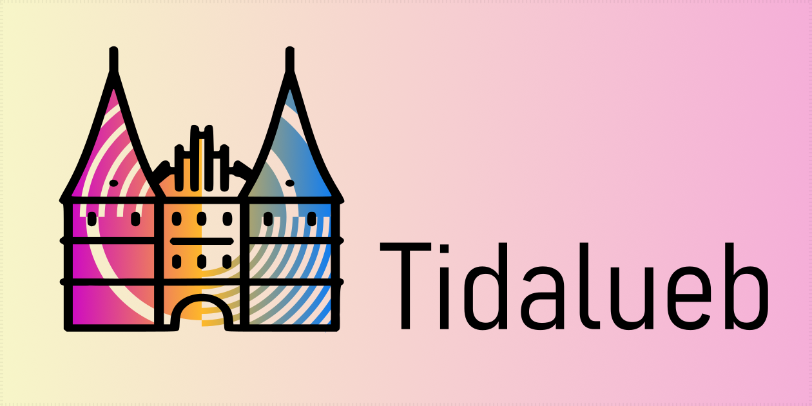

# tcii

Tidal Cycles Instrumental Interface.

The framework functions as a tmux workflow with different panes of a terminal performing different parts of the program.
It features an interpreter for Tidal Cycles, a snippets window for fast copying of precomposed material, a reference window that represents [the official reference](https://tidalcycles.org/docs/reference/cycles) in a brief format, and a SuperCollider server.


## Features
- Stable performance
- Easy installation
- Fast boot-up
- Automatic saving of the session (memory of last 10, but could be increased modifying finish.sh)
- Convenient keyboard shortcuts
- Syntax highlighting
- Reference as a cheat sheet
- No need to press Cmd+C to copy; copying is automatic while selecting
- For devs: all settings for dependencies are local and don't affect global .rc files
- Theoretically should work in any modern Bash terminal (tested only on MacOS)

## Installation

```sh
cd path-to-directory
git clone https://github.com/IliaViazov/tcii
./installation-macos.sh
```

The following script assumes that you have installed `git` and `homebrew`. The installation process is as follows:
- Installing Haskell
- Installing Python
- Installing the Tidal package for Haskell
- Installing the Nano editor
- Installing Glow
- Installing tmux
- Installing SuperCollider and SuperDirt

## Usage

### Start

```sh
cd path-to-directory
./tcii.command
```
or  
*just double-click* **the .command file**  
or  
*just double-click* **the app**

### Finish

In the interpreter window, type:
```haskell
:finish
```
and then close the window. The command `:finish` is an alliance of `hush`, `:quit` and saving script in `shell` that is written inside of `BootTidal.hs`

### Multi-line

Multi-line can be used in the standard Haskell manner:
```haskell
:{
d1 $ "bd sn bd sn"
# gain rand
# octer 0.5
# room 1
:}
```

## FAQ

### SuperCollider crashed during performance

`Cmd + .` to kill.  
`↑` then `Enter` to start again.

### How do I add my samples?

Adjust this part of the code inside the SuperCollider bootloader, adding your unique path or just put it into the Dirt Samples folder.
```supercollider
~dirt.loadSoundFiles("/Users/myUserName/Dirt-Samples/samples/*");
```
The path may differ from the example.

### How do I add my synths?

Adjust this part of the code inside the SuperCollider bootloader, adding your unique path or just put it into the Dirt Samples folder.
```supercollider
~dirt.loadSynthDefs("/Users/myUserName/SuperDirt/synthdefs/*");
```
The path may differ from the example.

### Don't like autocopying?

Adjust `.tmux.conf` inside the repository's folder.

## Future Plans

- Full support on Linux and Windows
- Additional sample library and SuperCollider library
- Support of Beamforming via parameters `#x`, `#y`, `#z`
- Direct Communication SynthDefs: OSC, MIDI, Serial, and G-Code
- Easy multiplayer via tmux remote feature


## References to the used resources, repos, and inspirations

- [Tidal Cycles](https://tidalcycles.org/)
- [SuperCollider](https://supercollider.github.io/)
- [Nano](https://www.nano-editor.org/)
- [Syntax Highlighting for Nano](https://github.com/scopatz/nanorc.git)
- [vim-tidal](https://github.com/tidalcycles/vim-tidal)
- [Glow](https://www.nano-editor.org/)
- [tmux](https://github.com/tmux/tmux/wiki)
- [Haskell](https://www.haskell.org/ghcup/)
- [Colored GHCI](https://github.com/rhysd/ghci-color/tree/master)
- [Python](https://www.python.org/)

The project is done and maintained with a great support of the [SACMT](https://www.instagram.com/mhl.sacmt/) at Musikhochschule Lübeck.
